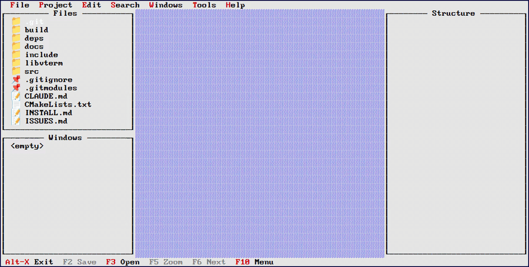
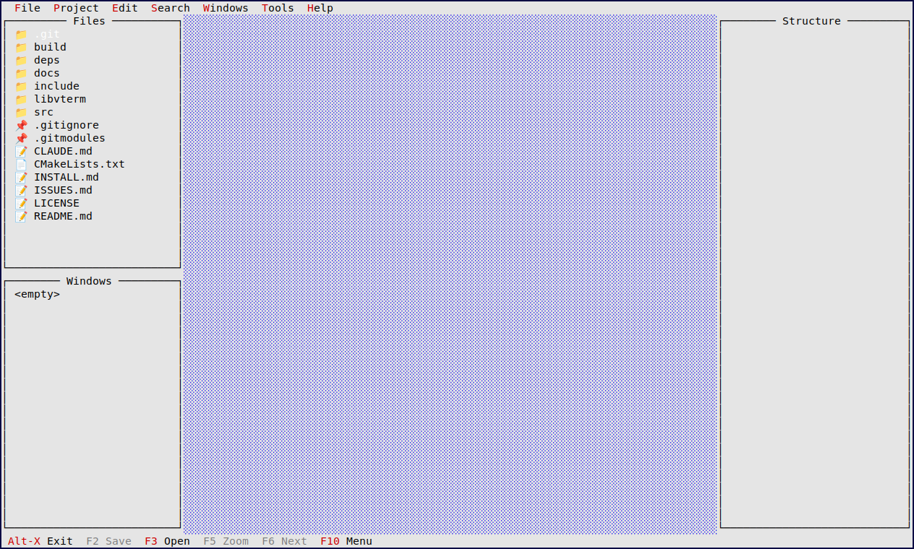
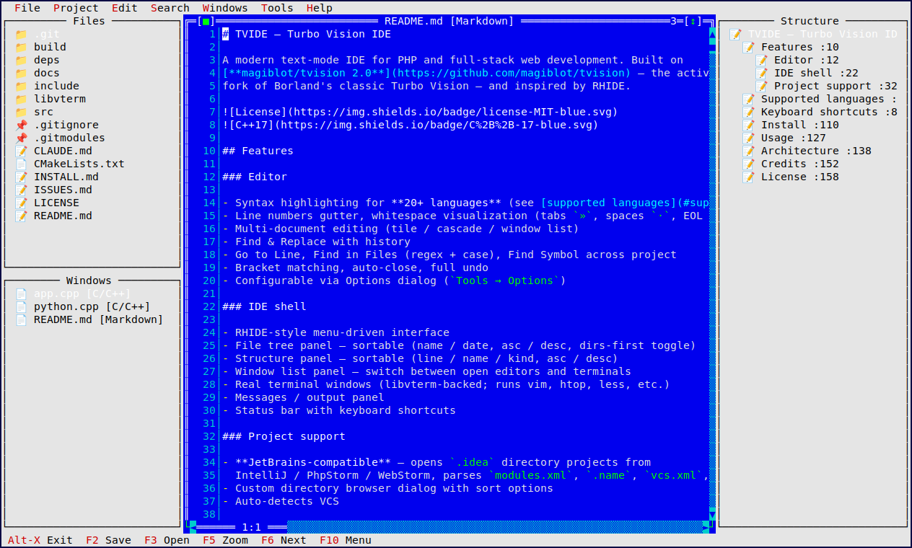
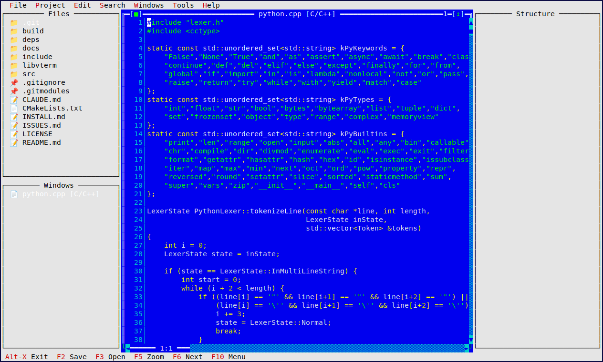

# TVIDE — Turbo Vision IDE

**IMPORTANT: This is work in progress and more of a showcase than usable app.**

A modern text-mode IDE for PHP and full-stack web development. Built on
[**magiblot/tvision 2.0**](https://github.com/magiblot/tvision) — the actively-maintained
fork of Borland's classic Turbo Vision — and inspired by RHIDE.


## Demo



## Screenshots

Default workspace — file tree, window list, structure panel pre-opened:



Editing a file with markdown syntax highlighting and live structure outline:



Editing C++ source with syntax highlighting, line gutter, and the open-window
list panel:



## Features

### Editor

- Syntax highlighting for **20+ languages** (see [supported languages](#supported-languages))
- Line numbers gutter, whitespace visualization (tabs `»`, spaces `·`, EOL `¶`)
- Multi-document editing (tile / cascade / window list)
- Find & Replace with history
- Go to Line, Find in Files (regex + case), Find Symbol across project
- Bracket matching, auto-close, full undo
- Configurable via Options dialog (`Tools → Options`)

### IDE shell

- RHIDE-style menu-driven interface
- File tree panel — sortable (name / date, asc / desc, dirs-first toggle)
- Structure panel — sortable (line / name / kind, asc / desc)
- Window list panel — switch between open editors and terminals
- Real terminal windows (libvterm-backed; runs vim, htop, less, etc.)
- Messages / output panel
- Status bar with keyboard shortcuts

### Project support

- **JetBrains-compatible** — opens `.idea` directory projects from
  IntelliJ / PhpStorm / WebStorm, parses `modules.xml`, `.name`, `vcs.xml`, `.iml`
- Custom directory browser dialog with sort options
- Auto-detects VCS

## Supported languages

Web stack: **PHP**, **HTML**, **CSS / SCSS / LESS**, **JavaScript / JSX**,
**TypeScript / TSX**, **Vue SFC**, **JSON**, **Markdown**, **YAML**, **SQL**,
**XML / SVG**, **Twig / Blade / Latte**.

Systems: **C / C++** (with `#`-preprocessor), **Java**, **C#**, **Go**, **Rust**,
**Kotlin**, **Swift**, **Lua**.

Scripts & data: **Python**, **Shell** (sh / bash / zsh / fish), **Ruby**.

Config: **Dockerfile**, **Makefile**, **INI**, **TOML**, **`.env`**, `.conf`,
`.properties`.

| Extension | Language |
|-----------|----------|
| `.php`, `.phtml` | PHP |
| `.html`, `.htm` | HTML |
| `.css`, `.scss`, `.less`, `.sass` | CSS |
| `.js`, `.jsx`, `.mjs`, `.cjs` | JavaScript |
| `.ts`, `.tsx` | TypeScript |
| `.vue` | Vue SFC |
| `.json`, `.jsonc` | JSON |
| `.md`, `.markdown` | Markdown |
| `.yml`, `.yaml` | YAML |
| `.sql` | SQL |
| `.xml`, `.svg`, `.xsl` | XML |
| `.twig`, `.blade`, `.latte` | Template |
| `.c`, `.cpp`, `.h`, `.hpp`, `.cc`, `.hh` | C / C++ |
| `.java` | Java |
| `.cs` | C# |
| `.go` | Go |
| `.rs` | Rust |
| `.kt`, `.kts` | Kotlin |
| `.swift` | Swift |
| `.lua` | Lua |
| `.py`, `.pyw`, `.pyi` | Python |
| `.sh`, `.bash`, `.zsh`, `.fish` | Shell |
| `.rb`, `.rake`, `.gemspec` | Ruby |
| `Dockerfile`, `Containerfile` | Dockerfile |
| `Makefile`, `*.mk` | Makefile |
| `.ini`, `.cfg`, `.conf`, `.properties` | INI |
| `.toml` | TOML |
| `.env`, `.env.*` | dotenv |

## Keyboard shortcuts

| Key | Action |
|-----|--------|
| F2 | Save |
| F3 | Open file |
| F4 | Search again |
| F5 | Zoom window |
| F6 | Next window |
| F10 | Menu |
| Ctrl-N | New file |
| Ctrl-T | New terminal |
| Ctrl-W | Close file |
| Ctrl-F | Find |
| Ctrl-H | Replace |
| Ctrl-G | Go to line |
| Ctrl-A | Select all |
| Ctrl-Z | Undo |
| Shift-F7 | Find in files |
| Ctrl-F12 | Find symbol |
| Alt-W | Window list |
| Alt-X | Exit |

When the file-tree panel has focus: `s` cycles sort modes, `d` toggles
"directories first".

## Install

See [INSTALL.md](INSTALL.md) for full install / build instructions.

Quick version (Debian / Ubuntu):

```bash
sudo apt install build-essential cmake libncurses-dev libgpm-dev perl
git clone --recursive https://github.com/macino/tvide.git
cd tvide
cmake -B build -DCMAKE_BUILD_TYPE=Release
cmake --build build -j$(nproc)
./build/tvide
```

If you forgot `--recursive`, run `git submodule update --init --recursive`.

## Usage

```bash
./build/tvide                                  # open empty IDE
./build/tvide src/index.php public/style.css   # open files
./build/tvide /path/to/project                 # open project directory
```

Or from the menu: `Project → Open project...` to pick a directory with sort
options; `File → Open` for individual files.

## Architecture

```
src/
├── main.cpp              # entry point
├── app.h / app.cpp       # TVIDEApp, menus, event dispatch, idle, layout
├── editor/               # syntax-highlighted editor + options dialog
├── syntax/               # one lexer per language family
├── dialogs/              # find / goto / findsymbol / openproject / about
├── project/              # JetBrains .idea parser
├── panels/               # filetree / structure / messages / winlist / terminal
└── tvterm-core/          # PTY + libvterm bridge (terminal windows)
```

## Credits

- [**magiblot/tvision 2.0**](https://github.com/magiblot/tvision) — modern Turbo Vision port (MIT)
- [**neovim/libvterm**](https://github.com/neovim/libvterm) — terminal emulator (MIT)
- [tvterm](https://github.com/magiblot/tvterm) — PTY/vterm bridge code adapted for tvision

## License

MIT License — see [LICENSE](LICENSE) for details. Bundled tvision and libvterm
are used under their respective licenses.
